# Capsa Wallet

#### The Algorand Wallet for the Web.


<span style="color:red">*Please note that this wallet is currently in alpha and has not been gone through a proper security audit yet. It currently connected only to Algorand testnet. It's advised not to use any seed phrases from your main wallets/wallets with real assets until a proper security audit been done.*</span>


Capsa is a Chrome extension which can be used to connect to Algorand blockchain:

## Features:
- Users can create new wallets
- Import existing wallets
- Check their Algo and other asset balances on Algorand blockchain.
- Send Algo and other assets between accounts on Algornad blockchain.
- Generate a QR code to receive Algos/assets from others on Algorand blockchain.
- The wallet seed is securely encrypted with the wallet password.
- User has an added security layer when sending Algos or assets to others by authenticating with wallet passwords before sending a transaction.
- Above all this wallet has Light and DARK modes!!!

## How to Install the extension
- Download the latest release from [releases](https://github.com/jokersden/capsa-wallet/releases)
- Go to the Chrome addressbar type: 
  ```chrome://extensions/```
- Enable developer mode:
  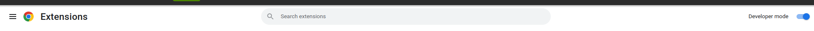
- Drag and drop the downloaded .crx file to extensions page and click add extension.
  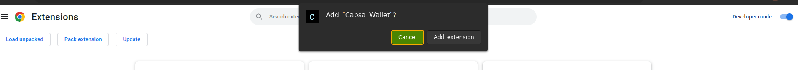

## How to use the wallet
- Once you've installed the extension, you will see Capsa Wallet on your Chrome extension bar, please make sure to pin it.

  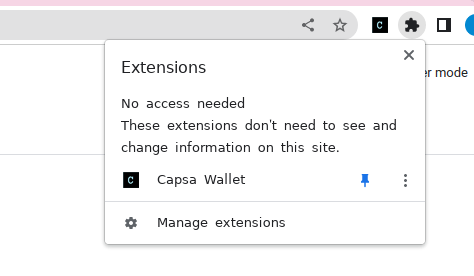
- When you click the extension for the first time you will get two options to create a wallet
  
  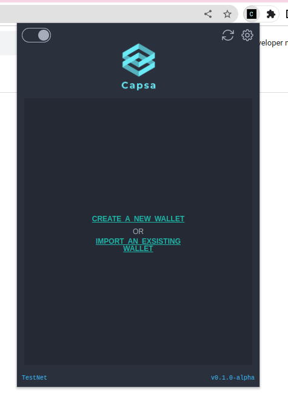

### Create a new wallet:
- You can create a brand new wallet by clicking create a new wallet and then giving a password for the wallet. (this password will be used to unlock your wallet and also authenticate you to when making a transaction)
  
  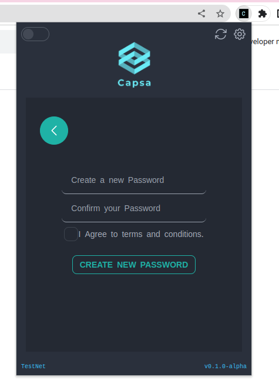
- Then you'll be give your seed phrase. <span style="color:red">Please Note that this seed phrase should be kept in a private and secure place and shouldn't be shared with anyone under any circumstances.</span>

  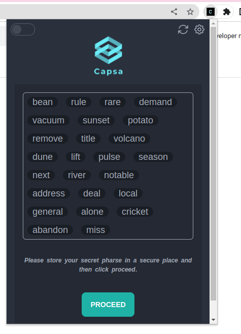

- Then confirm your seed phrase by entering 4th, 8th, 16th, and the 24th words of the generated seed phrase.
  
  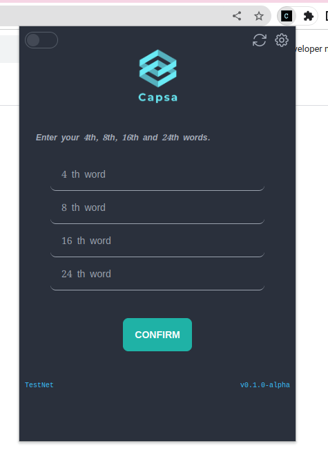

### Importing an existing wallet
- If you already have a seed phrase and import it to this wallet you can do so. Click on import an existing wallet and then create a password.
  
  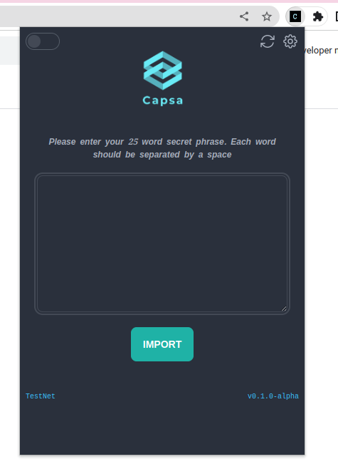 

### Your wallet and it's functionalities
- Once you created your wallet you will see the Algos you have, the USD value (queried from coingecko API) and the assets you own/opted in to.
  
  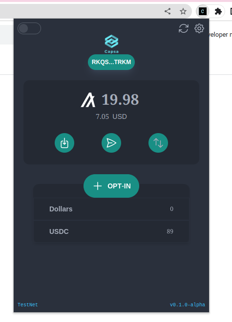

- From this main page you can click and copy your address to clipboard. 
- You can generate a QR to receive funds.
  
  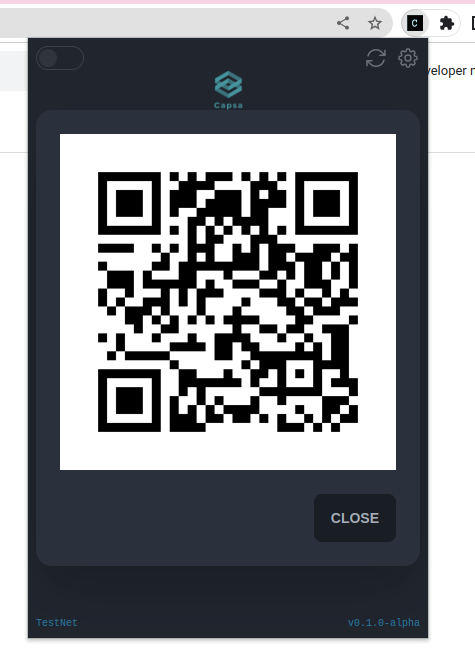

- You can send Algo and other assets by clicking on send.
  
  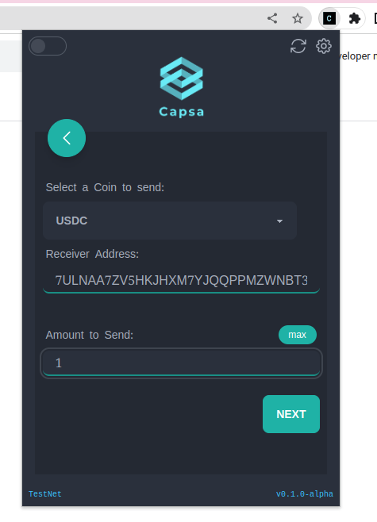

- In order to send, you need to first select which token you want to send (it will shows the opted in assets in a dropdown). And then you can specify the receiver and the amount or you can click max and retrive the maximum possible tokens that you can send.
- The wallet will make sure the entered address is a valid Algo address, and the amount that you are going to send are available in your wallet, before sending it to Algorand blockchain.
- Once your transaction passes the above verification it needs to be authenticated by the wallet password before sending.
  
  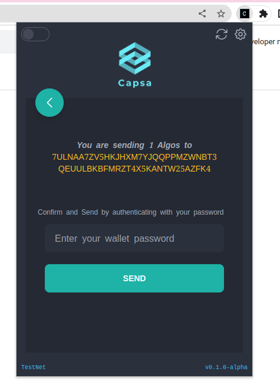

- If you want to opt in to a new assets you can do so by clicking Opt-in or if you have no assets it will show as Add a new asset.
  
  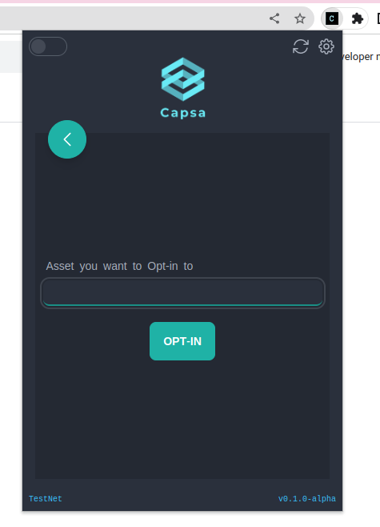

- You can change network, delete your wallet from the settings (the gear icon on top right corner)
  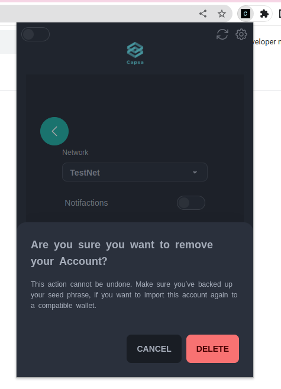

### Dark and Light modes
- You can always toggle between light and darkmodes by clicking the toggle on the top left corner.
  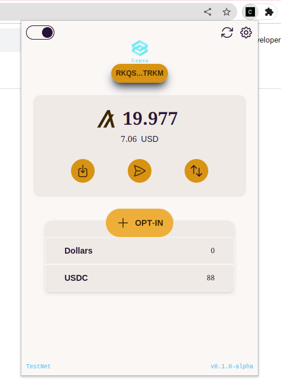


#### A quick video demo

[](https://www.youtube.com/watch?v=mxL_Q6Q2yZg)


## Contributing

- Clone the repo
- change directory to capsa-wallet:
 ```cd capsa-wallet```
- Install dependencies:
  ```npm install```
- Then run with:
  ```npm start```
- Or build the project and import to Chrome (you have to enable developer mode in Chrome for this):
  ```npm run build``` 

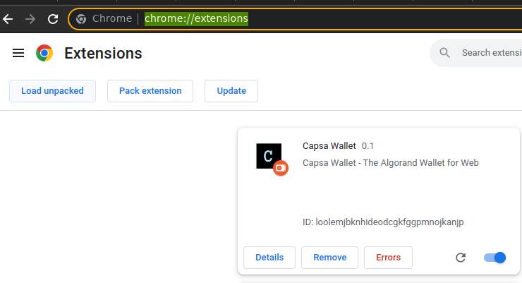
